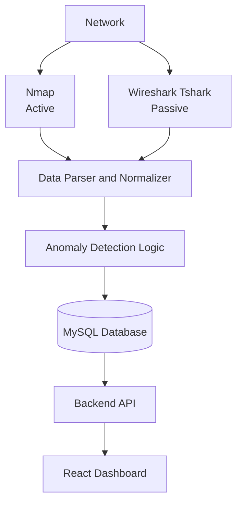

```mermaid
flowchart TD
    A[Network]
    A --> B[Nmap <br/>Active<br/>]
    A --> C[Wireshark Tshark <br/>Passive<br/>]
    B --> D[Data Parser and Normalizer]
    C --> D
    D --> E[Anomaly Detection Logic]
    E --> F[(MySQL Database)]
    F --> G[Backend API]
    G --> H[React Dashboard]
```
